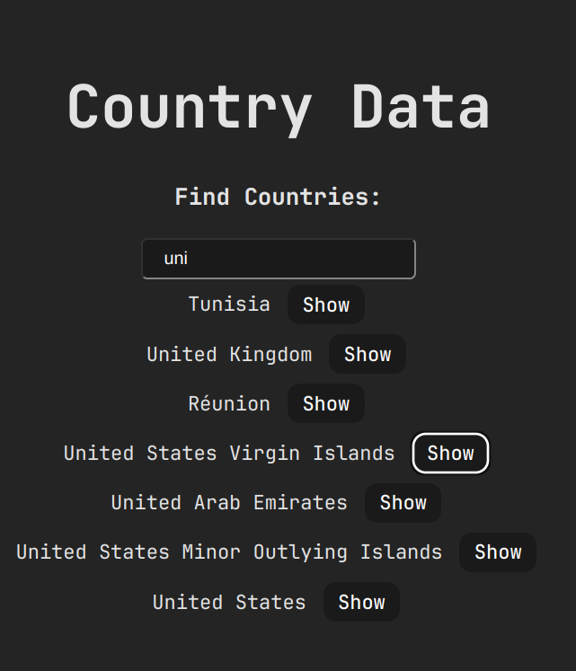
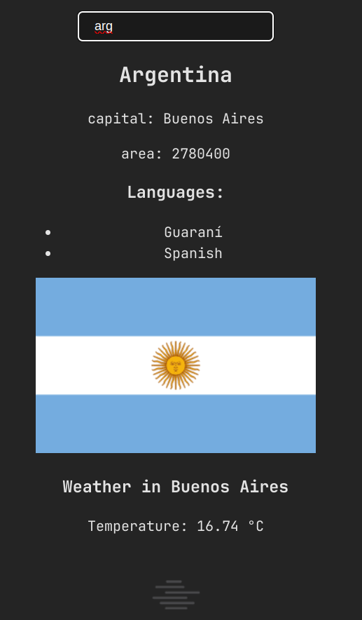

# Data Countries

this project implements two apis, one provides information about [countries](https://restcountries.com/v3.1/all), as its capital, languages, etc. And the other about the [climate](https://openweathermap.org) of its capital city, temperature and wind.

